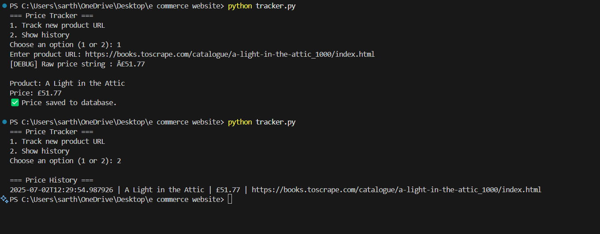

# 📦 Price Tracker CLI

A simple Python command-line tool to track product prices over time by scraping e-commerce product pages and storing price history in a local SQLite database.

Designed for Flipkart Grid preparation to showcase:
✅ Web scraping
✅ Database persistence
✅ CLI design

---

## 🚀 Features

- 🕵️ Scrape product name and price from a given URL
- 🗃️ Store price history with timestamp in SQLite
- 📜 View all historical price entries in the terminal
- ✅ Clean, modular codebase
- 📖 Easy to extend (e.g. add email notifications, CSV export)

---

## 📸 Demo

Example terminal session:

